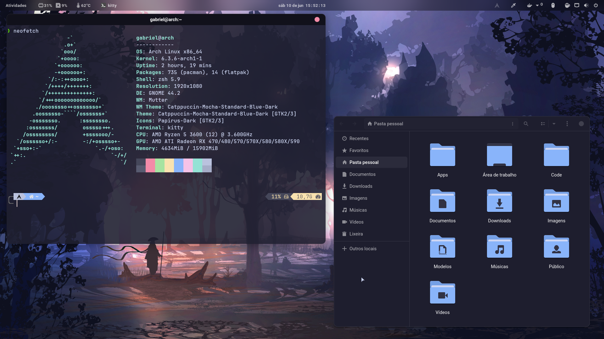

# Dotfiles [Arch Linux]

This is my Arch Linux installation setup. 😍

This guide translates my personal installation, with packages that I use in my daily life. Use as an example, never as an absolute truth! 😉

Thanks if you have suggestions for improvement. Make forks at will... 🫣

## Installation

This dotfiles and scripts are made for Arch Linux. Based on minimal installation using [archinstall](https://wiki.archlinux.org/title/Archinstall) script.

| Title               | Description                                                                                                                                            |
| ------------------- | ------------------------------------------------------------------------------------------------------------------------------------------------------ |
| Desktop Environment | Gnome                                                                                                                                                  |
| Total packages      | 741 (pacman), 14 (flatpak)                                                                                                                             |
| Terminal            | Kitty                                                                                                                                                  |
| Shell               | ZSH                                                                                                                                                    |
| GTK Theme           | Catppuccin Mocha Blue Dark                                                                                                                             |
| Icons               | Papirus Dark - Catppuccin Mocha Blue Folders                                                                                                           |
| Text Editor         | Neovim (AtroNvim), VSCodium                                                                                                                            |
| Web browser         | Firefox (default), Chromium                                                                                                                            |
| Gnome Apps          | Baobab, Calculator, Calendar, Contacts, Disks, EOG, Evince, File Roller, Font Viewer, Nautilus, Software (with pacman support), System Monitor, Tweaks |
| Other Apps          | Flameshot, Piper, VLC                                                                                                                                  |

## Usage

The actions below assume that you already have Arch Linux installed and logged in with your username.

All scripts run from a Makefile file

| Command                         | Description                                                                                                                                                                                                                                                                        |
| ------------------------------- | ---------------------------------------------------------------------------------------------------------------------------------------------------------------------------------------------------------------------------------------------------------------------------------- |
| `make clean`                    | Clean yay cache and remove unused packages                                                                                                                                                                                                                                         |
| `make copy_configs`             | Copy other configs (Flameshot)                                                                                                                                                                                                                                                     |
| `make docker_permissions`       | Set up docker permissions as $USER                                                                                                                                                                                                                                                 |
| `make enable_osprober`          | Enable OS Prober                                                                                                                                                                                                                                                                   |
| `make enable_services`          | Enable `docker` and `gdm` services                                                                                                                                                                                                                                                 |
| `make hide_apps`                | Hide many applications from the app grid                                                                                                                                                                                                                                           |
| `make install_flatpak`          | Install flatpak Apps                                                                                                                                                                                                                                                               |
| `make install_gnome_extensions` | Install Gnome Extensions                                                                                                                                                                                                                                                           |
| `make install_nvm`              | Install nvm and, as global and global packages (@nestjs/cli, @quasar/cli, @vue/cli, tree-sitter-cli)                                                                                                                                                                               |
| `make install_system`           | Install system packages usign yay                                                                                                                                                                                                                                                  |
| `make load_dconf`               | Loads dconf settings from dump file                                                                                                                                                                                                                                                |
| `make look`                     | Run `setup_gtk_theme`, `setup_icon_theme`, `setup_wallpaper`, `setup_cursors` and `load_dconf` commands                                                                                                                                                                            |
| `make mimetypes`                | Set many mimeapps and default applications                                                                                                                                                                                                                                         |
| `make setup_all`                | Run list of Makefile commands: `install_system`, `install_nvm`, `install_gnome_extensions`, `setup_term`, `install_flatpak`, `setup_nvim`, `look`, `update_zram`, `enable_osprober`, `docker_permissions`, `hide_apps`, `mimetypes`, `copy_configs`, `clean` and `enable_services` |
| `make setup_bat`                | Copy bat configs                                                                                                                                                                                                                                                                   |
| `make setup_cursors`            | Clone and install Catppuccin Cursors                                                                                                                                                                                                                                               |
| `make setup_discord_theme`      | Apply Catppuccin Mocha theme to discord                                                                                                                                                                                                                                            |
| `make setup_gtk_theme`          | Clone and install Catppuccin Mocha Blue Dark                                                                                                                                                                                                                                       |
| `make setup_icon_theme`         | Install Papirus Dark - Catppuccin Mocha Blue Folders                                                                                                                                                                                                                               |
| `make setup_kitty`              | Copy kitty configs                                                                                                                                                                                                                                                                 |
| `make setup_nvim`               | Clone AstroNvim and my personal config for nvim                                                                                                                                                                                                                                    |
| `make setup_oh_my_zsh`          | Clone Oh My ZSH and copy personal configs                                                                                                                                                                                                                                          |
| `make setup_term`               | Run `setup_kitty`, `setup_oh_my_zsh` and `setup_bat` commands                                                                                                                                                                                                                      |
| `make setup_wallpaper`          | Copy and apply wallpaper                                                                                                                                                                                                                                                           |
| `make update_zram`              | Update SWAP size (highest value between 4GiB and half total RAM)                                                                                                                                                                                                                   |
| `make yay`                      | Install yay package manager. (needed to run other commands)                                                                                                                                                                                                                        |

## Preview

#### Why I use Gnome DE?

Among numerous options for window management, such as BSPWM, Hyprland and others. Why did I choose to use Gnome? Simply for personal taste. I admire WMs, but Gnome has everything I need for my day to day and I feel productive with it. This is my opinion at the moment, but that may change in the future, I'm very interested in Hyprland. 🫣

## Links

- [My AstroNvim Config](https://github.com/gabrielscaranello/astronvim-config)
