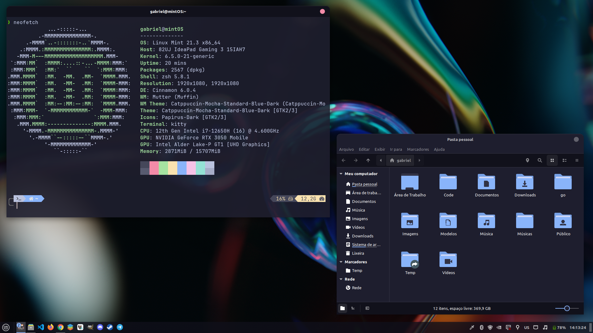

# Dotfiles \[Linux Mint\]

<!--toc:start-->
- [Dotfiles \[Linux Mint\]](#dotfiles-linux-mint)
  - [About](#about)
  - [Why I use Linux Mint?](#why-i-use-linux-mint)
  - [Installation details](#installation-details)
  - [Usage](#usage)
  - [Preview](#preview)
  - [Links](#links)
<!--toc:end-->

## About

This is my daily setup, based on Linux Mint Cinnamon Edition 😍

This guide translates my personal installation, with packages that I use in my
daily life. Use as an example, never as an absolute truth! 😉

Thanks if you have suggestions for improvement. Make forks at will... 🫣

## Why I use Linux Mint?  

I've been in the "Linux world" since 2018 and over the years I've installed and tested many distros, from different bases, such as Ubuntu, Fedora, PopOS, ZorinOS, Arch Linux and also Linux Mint.  

During this adventure I learned a lot, how each of the distros behave, their concepts and philosophies.
I really liked being able to install Arch Linux, I tested it with several interfaces, such as Gnome, Plasma and Cinnamon. But in the end I decided to go back to using Linux Mint instead of Arch Linux.  

**Why use Linux Mint?** This was the first distro I used that opened the doors to this world, I used it for almost two years before testing other distros, and I feel at home returning to it now. I see it as a strong foundation for both new and advanced users.  

I believe the Linux world is amazing, and applying it to building desktop systems is extremely important. Each person should be able to choose the OS that will best serve them to perform their day to day work and have fun. 

## Installation details

Make an installation using ISO file found in [official website](https://www.linuxmint.com/).

| Title                | Description                                                                                                                                                 |
| -------------------  | ----------------------------------------------------------------------------------------------------------------------------------------------------------- |
| Desktop Environment  | Cinnamon                                                                                                                                                    |
| Total packages       | Around 2560 packages                                                                                                                                        |
| Terminal             | Kitty                                                                                                                                                       |
| Shell                | ZSH (Oh My ZSH)                                                                                                                                             |
| GTK Theme            | Catppuccin Mocha Blue Dark                                                                                                                                  |
| Icons                | Papirus Dark - Catppuccin Mocha Blue Folders                                                                                                                |
| Text Editor          | Neovim (AtroNvim), VSCodium                                                                                                                                 |
| Web browser          | Google Chrome (default), Firefox                                                                                                                            |
| Default Apps Removed | celluloid, gnome-terminal, hexchat, hypnotix, libreoffice, redshift-gtk, rhythmbox, simple-scan, sticky, thingy, thunderbird, transmission, yaru-theme-icon |
| Installed Apps       | All included in [system_packages](./system_packages) file                                                                                                   |
| More Apps            | Bottom, DBeaver, Discord, Gitflow CJS, Lazydocker, Lazygit                                                                                                  |

## Usage

All scripts run from a Makefile file

| Command                        | Description                                             |
| ------------------------------ | ------------------------------------------------------- |
| `make add_repos`               | Add missign repositories needs to install packages      |
| `make clean`                   | Clean package cache and unneded packages                |
| `make copy_configs`            | Copy configs of lightdm and timeshift                   |
| `make docker_permissions`      | Set docker pertimissions to $USER                       |
| `make enable_services`         | Enable system services                                  |
| `make install_bottom`          | Install bottom package                                  |
| `make install_chrome`          | Install Google Chrome                                   |
| `make install_dbeaver`         | Install DBeaver                                         |
| `make install_discord`         | Install Discord                                         |
| `make install_git_flow_cjs`    | Install Gitflow by CJS                                  |
| `make install_jetbrains_fonts` | Install JetBrains fonts patched by Nerd Fonts           |
| `make install_lazydocker`      | Install Lazydocker                                      |
| `make install_lazygit`         | Install Lazygit                                         |
| `make install_nvm`             | Install NVM, yarn and install many packages             |
| `make install_system`          | Install system packages                                 |
| `make install_telegram`        | Install Telegram                                        |
| `make load_dconf`              | Load dconf configs                                      |
| `make look`                    | Setup look and feel                                     |
| `make purge_xterm`             | Purge xterm packages                                    |
| `make setup_all`               | Run all commands to configure system                    |
| `make setup_bat`               | Install bat theme                                       |
| `make setup_cinnamon`          | Setup Cinnamon configs                                  |
| `make setup_cursors`           | Configure cursors theme                                 |
| `make setup_discord_theme`     | Configure discord Catpuccin theme                       |
| `make setup_gtk_theme`         | Configure Catpuccin gtk theme                           |
| `make setup_icon_theme`        | Configure icons to setup Papirus with Catpuccin folders |
| `make setup_kitty`             | Setup kitty config                                      |
| `make setup_nvim`              | Setup Neovim configs                                    |
| `make setup_oh_my_zsh`         | Setup oh-my-zsh                                         |
| `make setup_term`              | Setup terminal configs and styles                       |
| `make setup_wallpaper`         | Setup wallpaper                                         |
| `make update_swap`             | Update swap configs                                     |
| `make update_system`           | Update system packages                                  |

## Preview

## Links

- [My AstroNvim Config](https://github.com/gabrielscaranello/astronvim-config)
