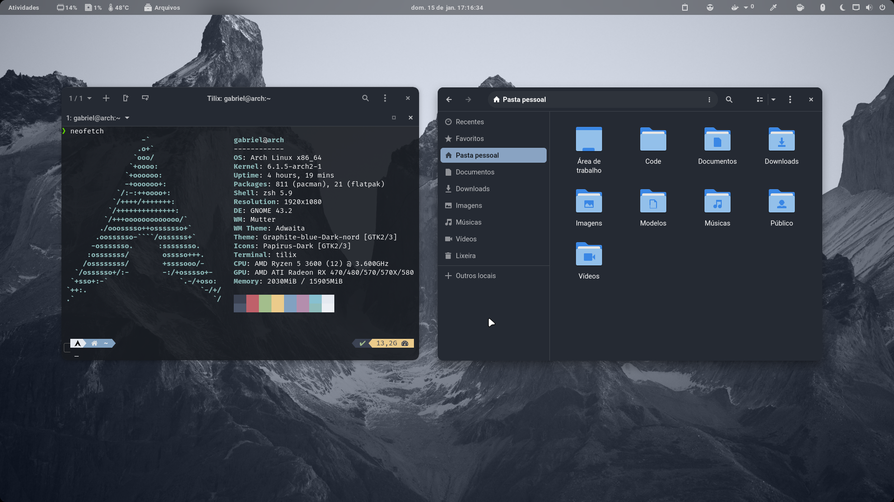
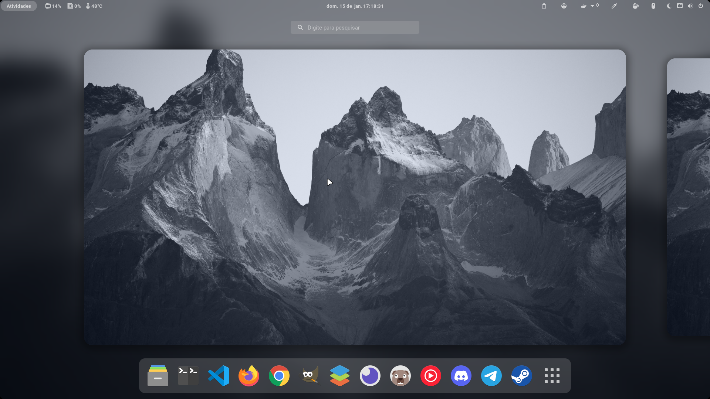

# Gabriel Scaranello - dotfiles

> My intention is to group all my settings in one place and share it with the community

# Preview



## Setup oh-my-zsh

Install font and theme for tilix (optional)
- [Fira Code Nerd Font](https://github.com/ryanoasis/nerd-fonts/blob/master/patched-fonts/FiraCode/Regular/complete/Fira%20Code%20Regular%20Nerd%20Font%20Complete.ttf)
- [Nord Theme for tilix](https://github.com/arcticicestudio/nord-tilix)

```sh
sh -c "$(curl -fsSL https://raw.github.com/ohmyzsh/ohmyzsh/master/tools/install.sh)"
```
After install oh-my-zsh run `./setup/zsh.sh`

> Source from `Android Studio`, `Flutter`, `nvm`, `yarn`, `composer` and `tilix` is on the `zsh/.profile`. Please, verify this sources after import and remove if doesn't use. 


## Look setup

The look is [Graphite-gtk-theme](https://github.com/vinceliuice/Graphite-gtk-theme) with [papirus-icon-theme](https://github.com/PapirusDevelopmentTeam/papirus-icon-theme) and cursor is [Bibata-cursor](https://github.com/ful1e5/Bibata_Cursor)

> This look script is make for [Arch linux](https://archlinux.org/) with [paru aur helper](https://github.com/Morganamilo/paru), will not work correctly in another configuration.
>
> More information about my Arch installation in [that repository](https://github.com/gabrielscaranello/arch)

